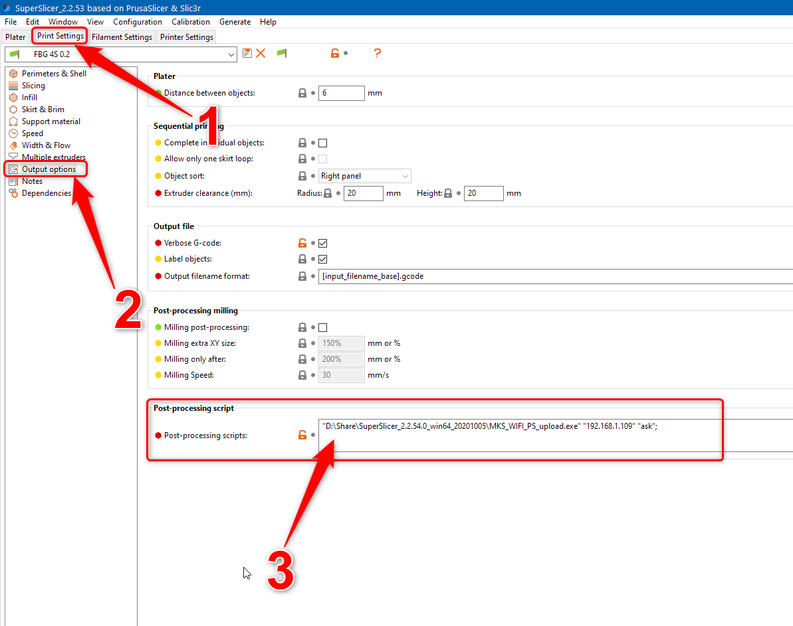

# MKS-WIFI Uploader for Prusa Slicer (and forks)

This simple tool allows uploading files and starting print jobs for printers equipped with Makerbase MKS-WIFI module (i.e. Flyingbear Ghost 4S/5)

#### Important notice
As of now (2021-01-17) the tool works fine. However, I curently have no printers with MKS-WIFI module. I'll do my best to maintain this tool in a working condition, but my debugging and development capabilities for this project are extremely limited.

### Versions
It is written on Python and available in 2 versions:
+ [Python script](src/MKS_WIFI_PS_upload.pyw) (requires Python 3 with **requests** package) 
+ Windows x64 executable (frozen with pyinstaller, more convinient, no requirements to run) could be found in [releases](/releases/latest)

I might think about releasing additional executables (like Win32 or linux) if there will be real demand for it. Until then you might always use Python script version (or pack the executable yourself using i.e. pyinstaller)

### Usage

It is originally intended to work as a post-processing script in Prusa Slicer (or it's forks like Slic3r++/SuperSlicer)
Download the script or executable to the location of your preference (not necessarely the istallation directory of your slicer). However, avoid using system directories like Program Files on Windows, otherwise your slicer might require elevated rights to run the script.
To use Uploader select your Print profile and go to the Output options. Here insert following command into the Post-processing script
##### To use executable (see screenshot)
```
"\path\to\the\executable\MKS_WIFI_PS_upload.exe" <ip_address> <mode>;
```

##### To use python script
```
"\path\to\the\python\installation\pythonw.exe" "\path\to\the\script\MKS_WIFI_PS_upload.pyw" <ip_address> <mode>;
```

##### Simplify3D
It is possible to use the script with Simplify3D slicer (however, it does not work if path to the g-code file contains spaces). Add following command to the "Additional Terminal Commands for Post Processing" section in the "Scripts" tab (quotes and brackets are necessary!)
```
"\path\to\the\executable\MKS_WIFI_PS_upload.exe" <ip_address> <mode> [output_filepath]
```
For more information see [Simplify3D forums](https://forum.simplify3d.com/viewtopic.php?f=8&t=1959)

##### <ip_address> - IP adress of the printer in your local network
##### mode - one of the following options:
+ **ask** - when a file is uploaded the script will ask if you want to immediately start printing it
+ **always** - when a file is uploaded the script will immediately start printing it without asking
+ **never** - when a file is uploaded the script will not start any print job and will not ask anything

You actually have to do this modification to every Print profile you want to use Uploader for.
After that each time you save a g-code file (to any location, not necessarely the same directory with the script) this file will be uploaded to your printer.

### Standalone mode
Despite being intended as a post-processing script, Uploader can be used completely standalone.
If run without any options (i.e. double click on the executable) it will first prompt you to select a file you want to upload and ask for IP adress of your printer. It will then proceed with uploading file and ask if you want to print it (similar to running in **ask** mode)

Alternatively you can run it from a command line providing path to you gcode file as the third option:
```
MKS_WIFI_PS_upload.exe ip_addr <mode> "\path\to\the\file\for\upload.gcode"
```
